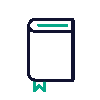
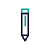

<div align="center">

 

<h1>My Packages CLI</h1>

My Packages is a Python-based CLI that allows you to store packages in a local relational database. The database is ran using SQLite3, making it quick and easy to spin up locally. All CRUD operations are performed through the CLI. You can also directly install packages that have been saved to the local DB to any project you wish.

<h2>Installation</h2> 

Fork and clone this repo.

Once cloned, ensure you install all dependancies using

```bash
pipenv install
```

<h2>Usage</h2> 

```python
python lib/cli.py
```

While in the project directory will launch the CLI

From there follow CLI options with user input to navigate and execute commands

<h2>Visuals</h2> 

_Main Menu_


_Language Menu_


_Package Menu_


_Dev Menu_


[Brief walkthrough video](https://youtu.be/036axs22Nvo)

<h2>Roadmap</h2> 

Support for other package mangers to come

```
bun
yarn
pip
```

Transition all menu functions to classes

Support for custom templates that can be shard to come

_ex: barebones react with just redux and react-icons_

Make this into an open source project once finished with school.

<h2>Contributing</h2> 

Pull requests are welcome. For major changes, please open an issue first
to discuss what you would like to change.

</div>
